# farm-merge-valley

Crops

  
| object name | code name | image |
| --- | --- | --- |
|  | avocado_1 |  |
|  | avocado_2 |  |
|  | avocado_3 |  |
|  | avocado_4 |  |
|  | carrot_1 | 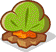 |
|  | carrot_2 |  |
|  | carrot_3 | 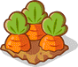 |
|  | carrot_4 | 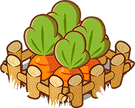 |
|  | coffee_1 |  |
|  | coffee_2 |  |
|  | coffee_3 |  |
|  | coffee_4 | 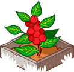 |
|  | corn_1 |  |
|  | corn_2 |  |
|  | corn_3 |  |
|  | corn_4 | 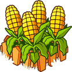 |
|  | soybeans_1 |  |
|  | soybeans_2 |  |
|  | soybeans_3 |  |
|  | soybeans_4 | 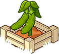 |
|  | sugarcane_1 |  |
|  | sugarcane_2 |  |
|  | sugarcane_3 |  |
|  | sugarcane_4 | 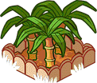 |
|  | sunflower_1 |  |
|  | sunflower_2 |  |
|  | sunflower_3 |  |
|  | sunflower_4 |  |
|  | tomato_1 |  |
|  | tomato_2 |  |
|  | tomato_3 | 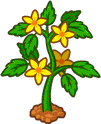 |
|  | tomato_4 | 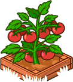 |
|  | wheat_1 |  |
|  | wheat_2 |  |
|  | wheat_3 | 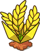 |
|  | wheat_4 | 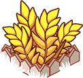 |

Animals

| object name | code name | image |
| --- | --- | --- |
|  | chicken_1 |  |
|  | chicken_2 | 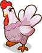 |
|  | chicken_3 | 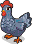 |
|  | chicken_4 | 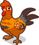 |
|  | cow_1 | 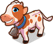 |
|  | cow_2 | 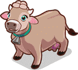 |
|  | cow_3 | 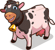 |
|  | cow_4 | 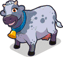 |
|  | deer_1 | 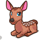 |
|  | deer_2 | 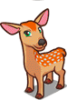 |
|  | deer_3 | 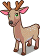 |
|  | deer_4 | 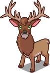 |
|  | goat_1 |  |
|  | goat_2 |  |
|  | goat_3 |  |
|  | goat_4 | 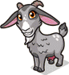 |
|  | pig_1 |  |
|  | pig_2 |  |
|  | pig_3 |  |
|  | pig_4 | 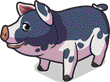 |
|  | sheep_1 | 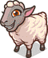 |
|  | sheep_2 | 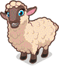 |
|  | sheep_3 | 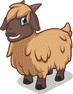 |
|  | sheep_4 | 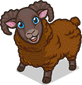 |
|  | trufflepig_1 | 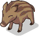 |
|  | trufflepig_2 | 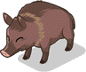 |
|  | trufflepig_3 | 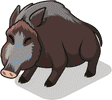 |
|  | trufflepig_4 | 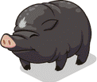 |

Decor

| object name | code name | image |
| --- | --- | --- |
|  | bakery | 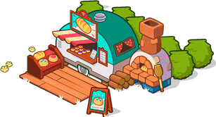 |
|  | barista |  |
|  | bbq | 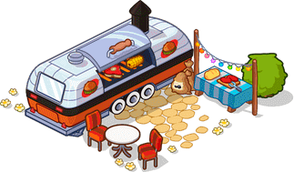 |
|  | building_avocadofiesta |  |
|  | building_trufflelicious | 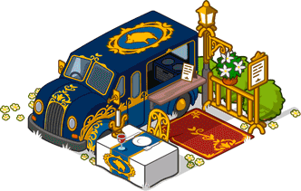 |
|  | dairy | 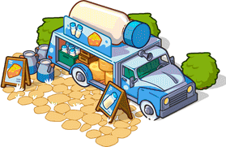 |
|  | loom |  |
|  | market | 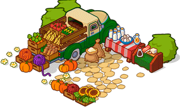 |
|  | museum |  |
|  | sweets | 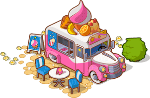 |
|  | decorative_barn | 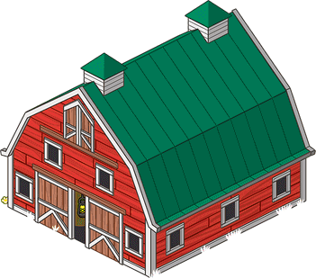 |
|  | decorative_birdshouse | 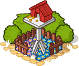 |
|  | decorative_chickencoop | 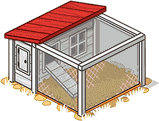 |
|  | decorative_doghouse | 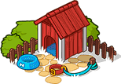 |
|  | decorative_farmhouse | 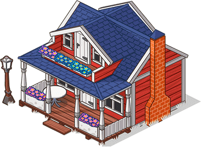 |
|  | decorative_feedingtrough | 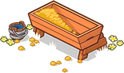 |
|  | decorative_flowerpots | 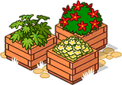 |
|  | decorative_fountain | 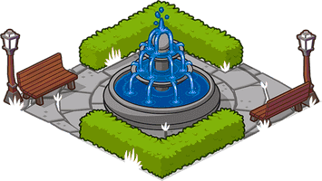 |
|  | decorative_haywagon | 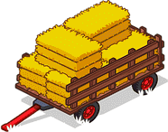 |
|  | decorative_lamppost | 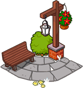 |
|  | decorative_milktank | 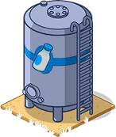 |
|  | decorative_picknicktable | 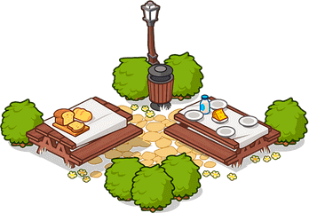 |
|  | decorative_shed |  |
|  | decorative_silo |  |
|  | decorative_stoneflowerpot |  |
|  | decorative_toilet |  |
|  | decorative_watertower |  |
|  | decorative_well |  |
|  | decorative_windmill |  |
|  | trainstation |  |
|  | delivery_cargo |  |
|  | delivery_truck |  |
|  | traintrack_stop |  |

decorative_halloween

| object name | code name | image |
| --- | --- | --- |
|  | decorative_halloween_blackcat |  |
|  | decorative_halloween_cauldron |  |
|  | decorative_halloween_ghosts |  |
|  | decorative_halloween_grandfatherclock |  |
|  | decorative_halloween_grave01 |  |
|  | decorative_halloween_grave02 |  |
|  | decorative_halloween_graveyard |  |
|  | decorative_halloween_hauntedhouse |  |
|  | decorative_halloween_pumpkinpatchbig |  |
|  | decorative_halloween_pumpkins01 |  |
|  | decorative_halloween_pumpkins02 |  |
|  | decorative_halloween_pumpkins03 |  |
|  | decorative_halloween_pumpkins04 |  |
|  | decorative_halloween_skeletonbench |  |
|  | decorative_halloween_skeletoncarousel |  |
|  | decorative_halloween_skeletonpicnic |  |
|  | decorative_halloween_skullaltar |  |
|  | decorative_halloween_treeface |  |
|  | decorative_halloween_well |  |

decorative_christmas

| object name | code name | image |
| --- | --- | --- |
|  | decorative_christmas_candygate |  |
|  | decorative_christmas_elfmail |  |
|  | decorative_christmas_elfteddy |  |
|  | decorative_christmas_elftrain |  |
|  | decorative_christmas_fireplace |  |
|  | decorative_christmas_gift01 |  |
|  | decorative_christmas_gift02 |  |
|  | decorative_christmas_gift03 |  |
|  | decorative_christmas_gingerbell |  |
|  | decorative_christmas_gingerbreadhouse |  |
|  | decorative_christmas_gingerbreadhousesmall |  |
|  | decorative_christmas_gingerbreadsnow |  |
|  | decorative_christmas_nutcracker |  |
|  | decorative_christmas_santagift |  |
|  | decorative_christmas_santamail |  |
|  | decorative_christmas_sleigh |  |
|  | decorative_christmas_snowcaroling |  |
|  | decorative_christmas_snowdinner |  |
|  | decorative_christmas_snowfight |  |
|  | decorative_christmas_snowgifting |  |
|  | decorative_christmas_snowglobe |  |
|  | decorative_christmas_snowjello |  |
|  | decorative_christmas_snowlantern |  |
|  | decorative_christmas_snowreindeer |  |
|  | decorative_christmas_snowtelescope |  |
|  | decorative_christmas_treebig |  |
|  | golden_christmas_tree_1 |  |
|  | golden_christmas_tree_2 |  |
|  | golden_christmas_tree_3 |  |
|  | golden_christmas_tree_4 |  |
|  | golden_jingleball_1 |  |
|  | golden_jingleball_2 |  |
|  | golden_jingleball_3 |  |
|  | golden_jingleball_4 |  |

Other

| object name | code name | image |
| --- | --- | --- |
|  | ticket |  |
|  | coin_1 |  |
|  | coin_2 |  |
|  | coin_3 |  |
|  | coin_4 |  |
|  | coin_5 |  |
|  | coin_6 |  |
|  | coin_7 |  |
|  | coin_8 |  |
|  | crate_1 |  |
|  | crate_2 |  |
|  | energy_1 |  |
|  | energy_2 |  |
|  | energy_3 |  |
|  | energy_4 |  |
|  | gem_1 |  |
|  | gem_2 |  |
|  | gem_3 |  |
|  | gem_4 |  |
|  | gem_5 |  |
|  | gem_6 |  |
|  | stone_1 |  |
|  | stone_2 |  |
|  | stone_3 |  |
|  | stone_4 |  |
|  | stone_5 |  |
|  | stone_6 |  |
|  | stone_7 |  |
|  | stone_8 |  |
|  | wood_1 |  |
|  | wood_2 |  |
|  | wood_3 |  |
|  | wood_4 |  |
|  | wood_5 |  |
|  | wood_6 |  |
|  | wood_7 |  |
|  | wood_8 |  |
|  | tool_1 |  |
|  | tool_2 |  |
|  | tool_3 |  |
|  | tool_4 |  |
|  | tool_5 |  |
|  | tool_6 |  |
|  | tool_7 |  |
|  | tool_8 |  |
|  | tool_9 |  |
|  | tool_10 |  |
|  | toolbox_small |  |
|  | toolbox_medium |  |
|  | toolbox_large |  |
|  | reward_key_bronze |  |
|  | reward_key_silver |  |
|  | reward_key_gold |  |
|  | reward_crate_chest_bronze |  |
|  | reward_crate_chest_silver |  |
|  | reward_crate_chest_gold |  |
|  | golden_carrot |  |
|  | golden_pumpkin |  |
|  | reward_crate_key_golden_carrot |  |
|  | reward_crate_golden_carrot |  |
|  | reward_crate_key_golden_pumpkin |  |
|  | reward_crate_golden_pumpkin |  |
|  | reward_crate_key_jingleballs |  |
|  | reward_crate_jingleballs |  |
|  | rock_small |  |
|  | rock_medium |  |
|  | rock_large |  |
|  | tree_small |  |
|  | tree_medium |  |
|  | tree_large |  |

